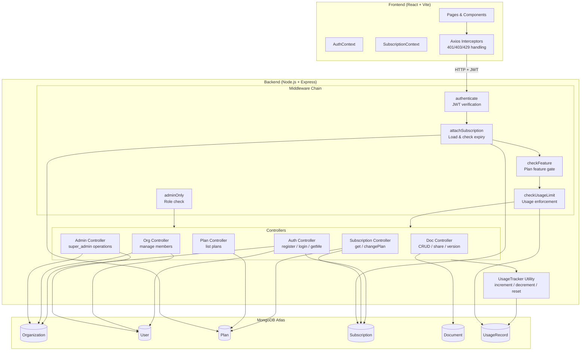
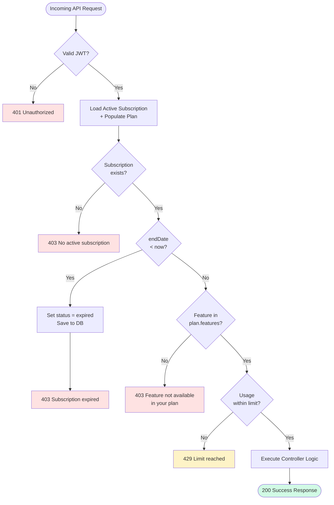
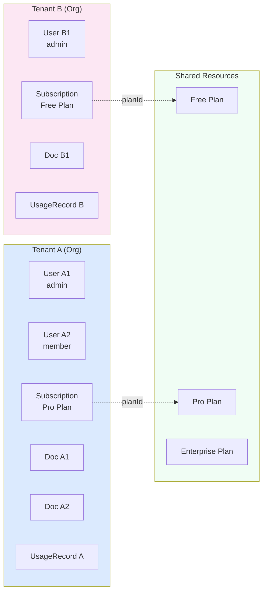

# System Architecture Diagram

## High-Level Architecture

```mermaid
flowchart TB
    subgraph Client["Frontend (React + Vite)"]
        UI[Pages & Components]
        AC[AuthContext]
        SC[SubscriptionContext]
        API[Axios Interceptors<br/>401/403/429 handling]
    end

    subgraph Server["Backend (Node.js + Express)"]
        subgraph MW["Middleware Chain"]
            AUTH[authenticate<br/>JWT verification]
            ATSUB[attachSubscription<br/>Load & check expiry]
            CF[checkFeature<br/>Plan feature gate]
            CUL[checkUsageLimit<br/>Usage enforcement]
            AO[adminOnly<br/>Role check]
        end

        subgraph Controllers
            AUTHC[Auth Controller<br/>register / login / getMe]
            DOCC[Doc Controller<br/>CRUD / share / version]
            SUBC[Subscription Controller<br/>get / changePlan]
            PLANC[Plan Controller<br/>list plans]
            ORGC[Org Controller<br/>manage members]
            ADMINC[Admin Controller<br/>super_admin operations]
        end

        UT[UsageTracker Utility<br/>increment / decrement / reset]
    end

    subgraph DB["MongoDB Atlas"]
        ORG[(Organization)]
        USR[(User)]
        PLN[(Plan)]
        SUB[(Subscription)]
        DOC[(Document)]
        URE[(UsageRecord)]
    end

    UI --> API
    API -->|HTTP + JWT| AUTH
    AUTH --> ATSUB
    ATSUB --> CF
    CF --> CUL
    CUL --> Controllers
    AO --> Controllers

    Controllers --> UT
    UT --> URE

    AUTHC --> USR
    AUTHC --> ORG
    AUTHC --> SUB
    DOCC --> DOC
    SUBC --> SUB
    SUBC --> PLN
    PLANC --> PLN
    ORGC --> USR
    ORGC --> ORG
    ADMINC --> ORG
    ADMINC --> USR

    ATSUB --> SUB
    ATSUB --> PLN
    CUL --> URE
```

## Entitlement Decision Flow

```mermaid
flowchart TD
    REQ([Incoming API Request]) --> JWT{Valid JWT?}
    JWT -->|No| R401[401 Unauthorized]
    JWT -->|Yes| LOAD[Load Active Subscription<br/>+ Populate Plan]

    LOAD --> ACTIVE{Subscription<br/>exists?}
    ACTIVE -->|No| R403A[403 No active subscription]
    ACTIVE -->|Yes| EXPIRY{endDate<br/>< now?}

    EXPIRY -->|Yes| EXPIRE[Set status = expired<br/>Save to DB]
    EXPIRE --> R403B[403 Subscription expired]

    EXPIRY -->|No| FEAT{Feature in<br/>plan.features?}
    FEAT -->|No| R403C[403 Feature not available<br/>in your plan]
    FEAT -->|Yes| LIMIT{Usage<br/>within limit?}

    LIMIT -->|No| R429[429 Limit reached]
    LIMIT -->|Yes| EXEC[Execute Controller Logic]
    EXEC --> RES([200 Success Response])

    style R401 fill:#fee2e2
    style R403A fill:#fee2e2
    style R403B fill:#fee2e2
    style R403C fill:#fee2e2
    style R429 fill:#fef3c7
    style RES fill:#d1fae5
```

## Tenant Isolation Strategy

```mermaid
flowchart LR
    subgraph Tenant_A["Tenant A (Org)"]
        UA1[User A1<br/>admin]
        UA2[User A2<br/>member]
        SA[Subscription<br/>Pro Plan]
        DA1[Doc A1]
        DA2[Doc A2]
        URA[UsageRecord A]
    end

    subgraph Tenant_B["Tenant B (Org)"]
        UB1[User B1<br/>admin]
        SB[Subscription<br/>Free Plan]
        DB1[Doc B1]
        URB[UsageRecord B]
    end

    subgraph Shared["Shared Resources"]
        P1[Free Plan]
        P2[Pro Plan]
        P3[Enterprise Plan]
    end

    SA -.->|planId| P2
    SB -.->|planId| P1

    style Tenant_A fill:#dbeafe
    style Tenant_B fill:#fce7f3
    style Shared fill:#f0fdf4
```
