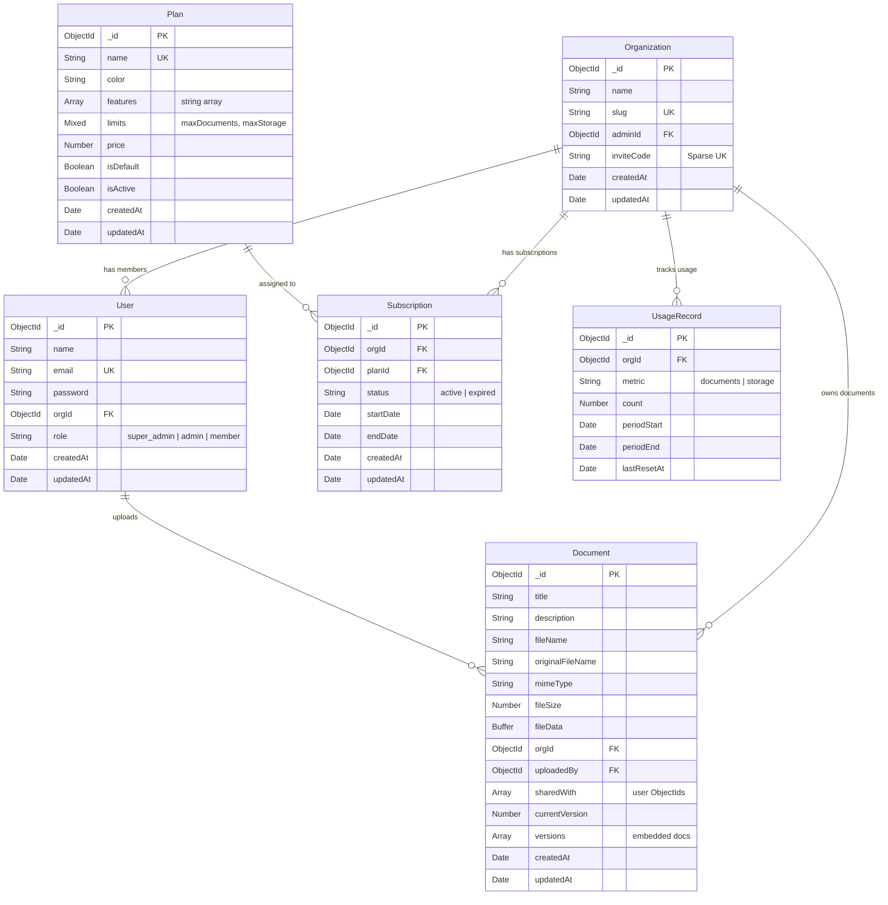
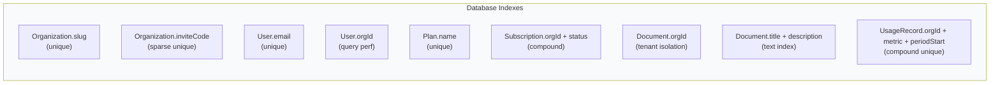

# Entity-Relationship Diagram

## Database Schema

## Index Strategy

## Feature-to-Plan Entitlement Matrix

| Feature | Free | Pro | Enterprise |
|---------|------|-----|------------|
| `doc_crud` | Yes | Yes | Yes |
| `sharing` | No | Yes | Yes |
| `versioning` | No | Yes | Yes |
| `advanced_search` | No | No | Yes |
| **maxDocuments** | 10 | 200 | Unlimited |
| **maxStorage** | 100 MB | 1 GB | Unlimited |
| **Price** | $0/mo | $29.99/mo | $99.99/mo |
